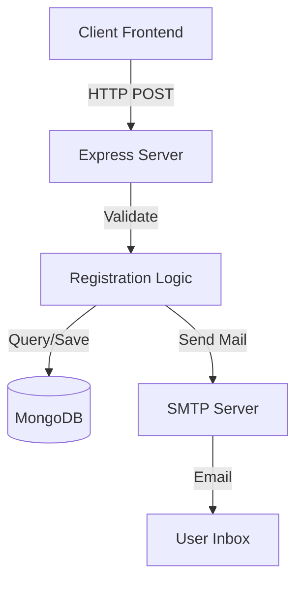

# Architecture Guide

This document outlines the technical architecture, data models, and design decisions for the C³ Backend.

## System Architecture

The application follows a standard **Model-Controller-Route** pattern (simplified for this scale) using Node.js and Express.



## Directory Structure

```
c3_backend/
├── models/              # Database Schemas
│   ├── newMembers.js    # [ACTIVE] Schema for club membership
│   └── registration.js  # [INACTIVE] Schema for event registration (legacy)
├── routes/              # API Route Definitions
│   └── register.js      # Handles registration logic and email dispatch
├── images/              # Static assets (logos)
├── server.js            # Entry point, middleware, and DB connection
└── package.json         # Dependencies
```

## Data Models

### 1. New Members (Active)
**File:** `models/newMembers.js`
**Collection:** `newmembers`

Used for storing general club membership data.

| Field | Type | Required | Description |
|-------|------|----------|-------------|
| `name` | String | Yes | Full name of the student |
| `email` | String | Yes | Unique identifier |
| `mobile` | String | Yes | Contact number |
| `rollNumber` | String | Yes | University Roll ID |
| `department` | String | Yes | e.g., CSE, ECE |
| `year` | String | Yes | Academic year |
| `interests` | Array | Yes | List of technical interests |
| `experience` | String | No | Prior experience details |
| `expectations` | String | No | What they expect from the club |
| `referral` | String | No | How they heard about us |

### 2. Registration (Inactive)
**File:** `models/registration.js`
**Collection:** `registrations`

*Note: This model is currently dormant. It was designed for specific event registrations involving ticket generation.*

| Field | Type | Description |
|-------|------|-------------|
| `registrationID` | String | Unique ID for event tickets |
| `name`, `email`, etc. | String | Participant details |

## Key Workflows

### Membership Registration Flow
1. **Input Validation:** The `/api/register` endpoint validates that all mandatory fields (name, email, rollNumber, etc.) are present.
2. **Duplicate Check:** Queries MongoDB to ensure the `email` is not already registered.
3. **Persistence:** Saves the new member document to the `newmembers` collection.
4. **Notification:**
   - Configures `nodemailer` transport.
   - Attempts connection via standard TLS (Port 587).
   - Fallback to SSL (Port 465) if TLS fails.
   - Sends an HTML-formatted welcome email.
5. **Response:** Returns a JSON success message to the client.

## Future Considerations

- **Event Ticketing:** The `pdf-lib` dependency and `registration.js` model are retained to support re-enabling PDF ticket generation for future events.
- **Admin Dashboard:** Future updates may expose GET endpoints to allow admins to view registered members (currently requires direct DB access).
